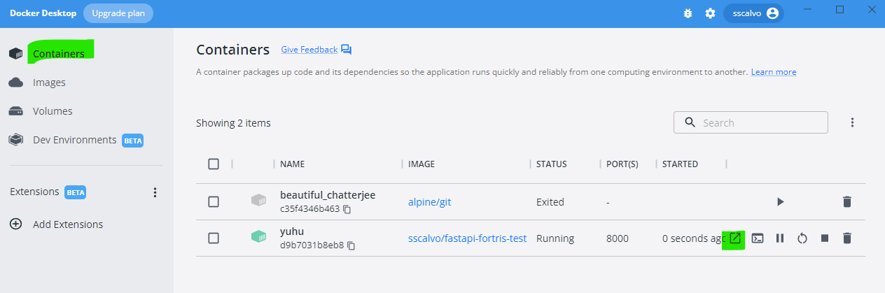

# ft_assignment
### API service with five endpoints

#### Option 1: Command line
Download docker image with:

`sudo docker pull sscalvo/fastapi-fortris-test:1.2`

Now you can launch it with:

`sudo docker run -p 8000:8000 --name fortris-api sscalvo/fastapi-fortris-test:1.2 -e "KEY=<your api key for weather>`

You should substitute `<your api key for weather>` with your real API KEY from  https://www.weatherapi.com/

Now open your browser and point it to http://localhost:8000 and follow the instructions

#### Option 2: docker-compose

Under the "Images" section, select the `sscalvo/fastapi-fortris-test:1.2` image and click on the RUN button

You wil see this pop-up window for optional settings:

Set the `container name`as `yuhu`

Set the `host port` as `8000`

And finally set an enviroment variable called `KEY` with your real API KEY from  https://www.weatherapi.com/ and click the RUN button

This will open the "Containers" section. Locate the "yuhu" container and click on the "Open in browser" button (selected in green in the below image)

Your browser will open pointing to http://localhost:8000 and then just follow the instructions

#### Option 3: Build your own

Clone this repository in your local folder

`git clone https://github.com/sscalvo/ft_assignment`

**Build** it with docker:

`sudo docker build -t sscalvo/fastapi-fortris-test:1.2 .`

**Launch** it:

`sudo docker run -p 8000:8000 --name fortris-api sscalvo/fastapi-fortris-test:1.2 -e "KEY=<your api key for weather>`

You should substitute `<your api key for weather>` with your real API KEY from  https://www.weatherapi.com/

Now open your browser and point it to http://localhost:8000 and follow the instructions

